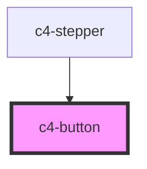

# c4-button

<!-- Auto Generated Below -->

## Properties

| Property      | Attribute      | Description | Type                                             | Default     |
| ------------- | -------------- | ----------- | ------------------------------------------------ | ----------- |
| `buttonClass` | `button-class` |             | `"left" \| "right" \| "secondary" \| "tertiary"` | `undefined` |
| `disabled`    | `disabled`     |             | `boolean`                                        | `false`     |
| `href`        | `href`         |             | `string`                                         | `"#"`       |
| `tag`         | `tag`          |             | `string`                                         | `"button"`  |
| `type`        | `type`         |             | `string`                                         | `"button"`  |

## Dependencies

### Used by

 - [c4-stepper](../c4-stepper)

### Graph

----------------------------------------------

*Built with [StencilJS](https://stenciljs.com/)*
