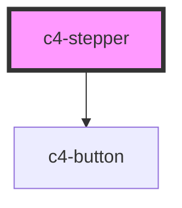

# c4-stepper

<!-- Auto Generated Below -->

## Properties

| Property     | Attribute     | Description | Type     | Default |
| ------------ | ------------- | ----------- | -------- | ------- |
| `max`        | `max`         |             | `number` | `null`  |
| `min`        | `min`         |             | `number` | `null`  |
| `startValue` | `start-value` |             | `number` | `null`  |

## Dependencies

### Depends on

- [c4-button](../c4-button)

### Graph

----------------------------------------------

*Built with [StencilJS](https://stenciljs.com/)*
